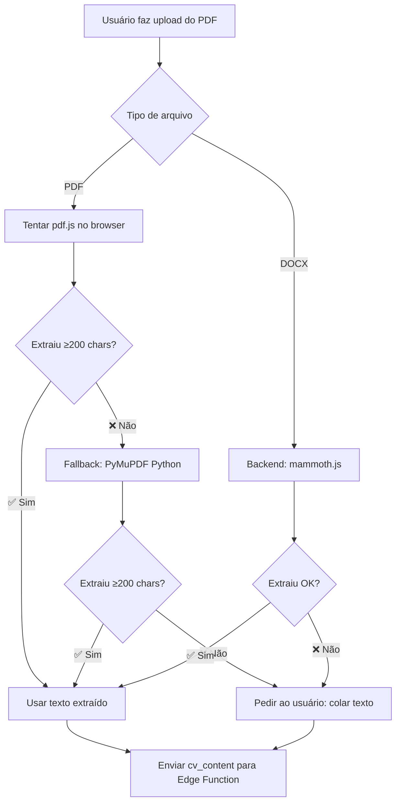

# Arquitetura de Extração de CV

## 🎯 Visão Geral

Sistema de extração de texto de CVs em 3 níveis (client-first com fallback robusto):

```
1. pdf.js (Browser) → Rápido, grátis, funciona com 80% dos PDFs
   ↓ Falhou ou < 200 chars?
2. PyMuPDF (Python) → Extrator profissional, funciona com PDFs do Figma
   ↓ Falhou?
3. Texto Manual → Usuário cola o texto diretamente
```

## 📊 Fluxo de Extração



## 🏗️ Componentes

### 1. Frontend (`DiagnosticForm.tsx`)

**Responsabilidades:**
- Tentar extração local (pdf.js) primeiro
- Fallback para PyMuPDF se falhar
- Sempre enviar `cv_content` (texto) para backend

**Lógica:**
```typescript
// 1️⃣ Tentar pdf.js (browser)
try {
  const text = await extractPdfInBrowser(cvFile);
  if (text.length >= 200) {
    cvPayload = { cv_content: text };
  }
} catch {
  // 2️⃣ Fallback: PyMuPDF (Python microservice)
  try {
    const text = await extractWithPythonFallback(cvFile);
    if (text.length >= 200) {
      cvPayload = { cv_content: text };
    }
  } catch {
    // 3️⃣ Último recurso: pedir texto manual
    toast("Cole o texto do CV manualmente");
  }
}
```

### 2. Python Microservice (`python-extractor/`)

**Tecnologias:**
- FastAPI (framework web)
- PyMuPDF/fitz (extração robusta de PDF)
- Docker (deploy)

**Endpoint:**
```
POST /extract
Content-Type: multipart/form-data

file: <arquivo.pdf>
```

**Vantagens:**
- ✅ Extrai PDFs do Figma com fontes custom
- ✅ Funciona com subset fonts
- ✅ Mais robusto que pdf.js
- ✅ Independente do ambiente Edge Function

**Deploy:**
- Render.com (Free Tier) - recomendado
- Google Cloud Run
- AWS Lambda

### 3. Backend Edge Function (`diagnostico`)

**Simplificação:**
- ❌ Removida toda lógica de extração de PDF/DOCX
- ✅ Recebe apenas `cv_content` (texto) do frontend
- ✅ Foco em: validação + análise AI + scraping job + salvar DB

**Interface:**
```typescript
interface DiagnosticInput {
  email: string;
  cv_content: string;      // Obrigatório - sempre vem do frontend
  job_description?: string; // Opcional - texto direto
  job_url?: string;         // Opcional - URL para scraping
}
```

## 📦 Arquivos Criados/Modificados

### Criados:
- `python-extractor/app.py` - FastAPI server
- `python-extractor/requirements.txt` - Dependências Python
- `python-extractor/Dockerfile` - Container para deploy
- `python-extractor/README.md` - Instruções de deploy
- `python-extractor/.gitignore` - Ignorar cache Python

### Modificados:
- `src/components/DiagnosticForm.tsx` - Lógica de fallback PyMuPDF
- `supabase/functions/diagnostico/index.ts` - Removida extração
- `.env` - Adicionado `VITE_PYTHON_EXTRACTOR_URL`

### Deletados:
- `supabase/functions/extract-cv/index.ts` - Não é mais necessário

## 🚀 Deploy do Microserviço

### Render.com (Recomendado)

1. Criar conta em [render.com](https://render.com)
2. New > Web Service
3. Conectar repositório Git
4. Configurar:
   - **Root Directory**: `python-extractor`
   - **Runtime**: Docker
   - **Instance Type**: Free
5. Deploy e copiar a URL gerada

### Atualizar .env

```env
VITE_PYTHON_EXTRACTOR_URL=https://pdf-extractor-abc123.onrender.com/extract
```

## 🧪 Testar

### 1. Teste Local do Python

```bash
cd python-extractor
pip install -r requirements.txt
python app.py

# Em outro terminal
curl -X POST http://localhost:8000/extract \
  -F "file=@/caminho/para/teste.pdf"
```

### 2. Teste Frontend

1. Fazer upload de PDF normal → deve usar pdf.js
2. Fazer upload de PDF do Figma → deve cair no PyMuPDF
3. Verificar logs do console:
   - `🚀 [Browser] Tentando pdf.js...`
   - `⚠️ [Browser] pdf.js falhou`
   - `🐍 [Python] Enviando PDF para microserviço...`
   - `✅ [Python] PyMuPDF extraiu: X caracteres`

## 📈 Métricas de Sucesso

| Cenário | Antes | Depois |
|---------|-------|--------|
| PDFs normais | pdf.js ✅ | pdf.js ✅ |
| PDFs do Figma | ❌ Falha | PyMuPDF ✅ |
| PDFs com fontes custom | ❌ Falha | PyMuPDF ✅ |
| DOCX | Backend ✅ | Backend ✅ |
| Texto manual | ✅ | ✅ |

## 🔮 Melhorias Futuras

1. **OCR para PDFs Escaneados:**
   ```python
   # Adicionar ao app.py
   import pytesseract
   from PIL import Image
   
   if len(text) < 50:
       # Aplicar OCR nas imagens do PDF
       for page in doc:
           pix = page.get_pixmap()
           img = Image.frombytes("RGB", [pix.width, pix.height], pix.samples)
           ocr_text = pytesseract.image_to_string(img, lang='por')
           text += ocr_text
   ```

2. **Cache de Extrações:**
   - Salvar hash do arquivo + texto extraído
   - Evitar reprocessar o mesmo PDF

3. **Métricas de Uso:**
   - Quantos PDFs usam pdf.js vs PyMuPDF
   - Taxa de sucesso de cada método
   - Tempo médio de extração

## 🛠️ Troubleshooting

### Erro: "Python extractor failed (500)"

**Causa:** Microserviço não está rodando ou URL incorreta

**Solução:**
1. Verificar se o deploy está ativo no Render
2. Testar URL diretamente: `curl https://sua-url/`
3. Conferir logs do Render

### Erro: "PDF não suportado"

**Causa:** PyMuPDF também falhou em extrair texto

**Possíveis motivos:**
- PDF escaneado (apenas imagens, sem texto)
- PDF corrompido
- Fontes não suportadas

**Solução:** Usuário deve colar o texto manualmente

### PDF do Figma ainda não funciona

**Verificar:**
1. Console do browser: logs de fallback aparecem?
2. Microserviço Python está respondendo?
3. URL no `.env` está correta?
4. Testar microserviço diretamente com o PDF problemático

## 📞 Suporte

- **Logs do Frontend:** Console do navegador (F12)
- **Logs do Python:** Dashboard do Render > Logs
- **Logs do Edge:** Supabase Dashboard > Edge Functions > Logs

## 🎓 Lições Aprendidas

1. **Client-first é mais rápido:** pdf.js no browser evita latência de rede
2. **Fallback robusto é essencial:** Nenhuma lib extrai 100% dos PDFs
3. **Microserviço dedicado é melhor:** Mais flexível que Edge Function
4. **PyMuPDF é o padrão-ouro:** Se ele não extrair, provavelmente é PDF escaneado
